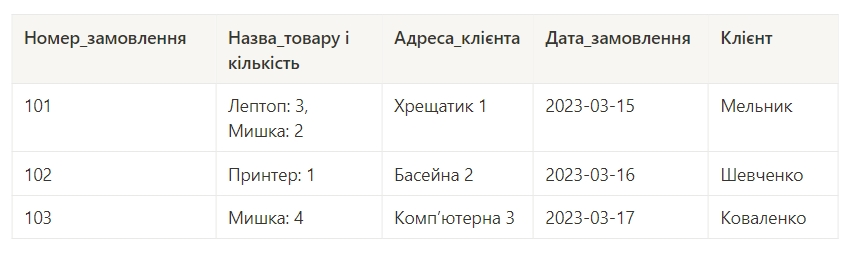
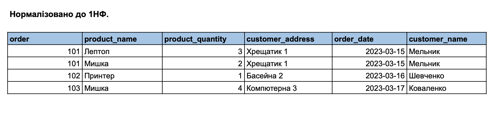
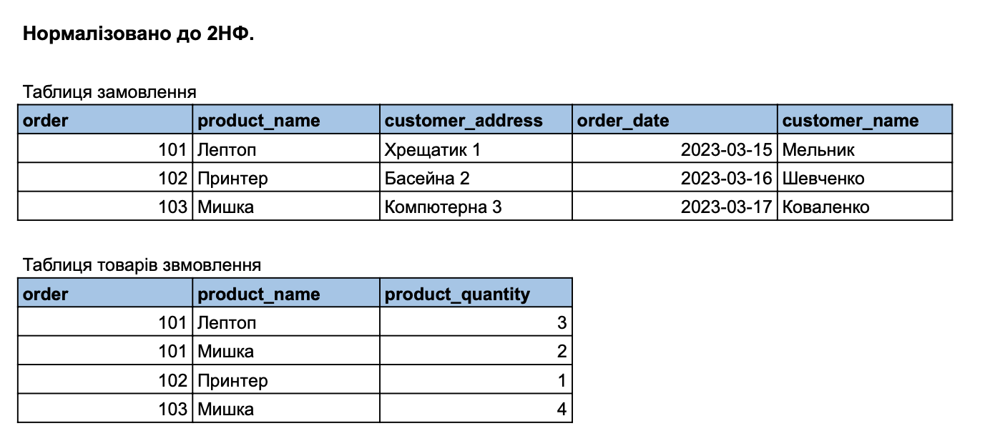
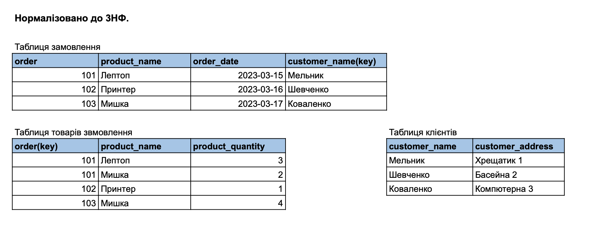
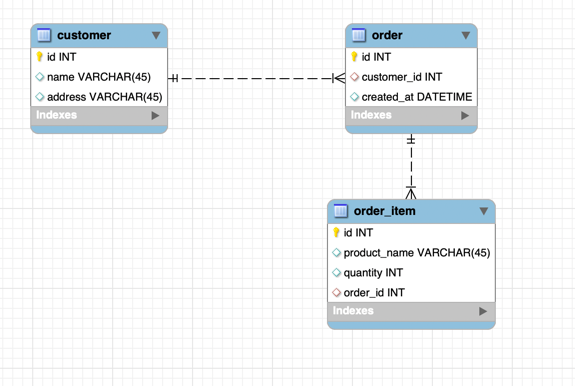
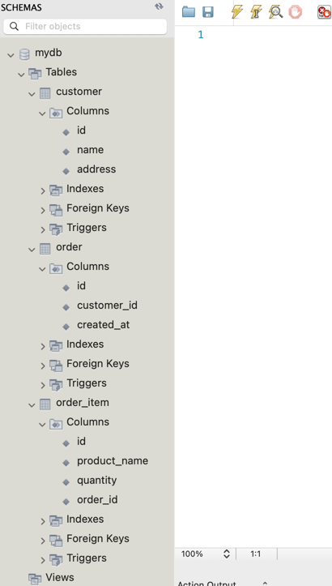

# Домашнє завдання до Теми 2. Проектування баз даних з використанням семантичних моделей

## Опис домашнього завдання

1. Переведіть початкову таблицю в першу нормальну форму.

2. Переведіть нові таблиці в другу нормальну форму.

3. Переведіть нові таблиці в третю нормальну форму.

4. Розробіть ER-діаграму отриманих таблиць.

- 💡 Використовуйте зрозумілі та конкретні імена для сутностей та атрибутів. Уточнюйте типи даних для атрибутів. Перевірте, чи всі відношення й атрибути мають чіткі і зрозумілі кардинальності та значення.

5. Використовуючи ER-діаграму, створіть таблиці в базі даних. Оформте ці таблиці без конкретних значень, тільки з урахуванням колонок та їхніх зв'язків, вручну або автоматично.

#### Початкова таблиця

## Критерії прийняття

1. Прикріплені посилання на репозиторій `goit-rdb-hw-02` та безпосередньо самі файли репозиторію архівом.

2. Нормалізовано таблицю до 1НФ.

3. Нормалізовано таблицю до 2НФ.

4. Нормалізовано таблицю до 3НФ.

- 💡 Результат нормалізації таблиць може бути в довільній формі/форматі (Google Doc, Google таблиці тощо).

5. Створено ER-діаграму отриманих таблиць. Діаграма має відповідати нормалізованим таблицям.

- 💡 Має бути декілька таблиць зі зв’язком між ними. Результат може бути у вигляді файлу та/або скриншота.

6. Використано зрозумілі та конкретні імена для сутностей та атрибутів. Уточнено типи даних для атрибутів. Усі відношення й атрибути мають чіткі і зрозумілі кардинальності та значення.

7. Створено таблиці в базі даних (тільки таблиці й колонки з урахуванням зв'язків) вручну або автоматично.

- 💡 Результат має бути у вигляді скриншота розгорнутої схеми у Workbench.

## Результат виконаного ДЗ

1. Нормалізовано таблицю до 1НФ.
   
2. Нормалізовано таблицю до 2НФ.
   
3. Нормалізовано таблицю до 3НФ.
   
4. Створено ER-діаграму отриманих таблиць.
   
5. Створено таблиці в базі даних.
   
